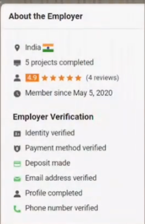

### طبق آمار سایت فریلنسر، تنها یک‌سوم پروژه‌هایی که در این سایت آپلود می‌شوند به فریلنسرها واگذار می‌گردند. این یعنی بیش از ۶۰ درصد یا دو‌سوم پروژه‌ها هرگز به کسی داده نمی‌شوند.

---

### برای اینکه شما بتوانید پروژه‌ای را بگیرید، باید برای آن پروژه **بید** ارسال کنید یا **پروپوزال** بنویسید (درخواست).

---

### هر پروژه شامل دو بخش است:

1. **اطلاعات پروژه**

   1. عنوان پروژه
   2. متن توضیحات

      * توضیحات جایی است که کارفرما به شکل کامل بیان می‌کند چه انتظاراتی از شما به عنوان فریلنسر دارد.
   3. بازه قیمتی تعیین‌شده توسط کارفرما + تعدادی تگ و فایل‌های پیوست (Attachment)

   

2. **اطلاعات کارفرما**

   1. کشور محل سکونت کارفرما
   2. تعداد ریویو یا بازخوردهایی که قبلاً گرفته است

      * هم فریلنسر و هم کارفرما باید در پایان هر پروژه به یکدیگر ریویو (امتیاز از ۰ تا ۵) بدهند. این موضوع نشان می‌دهد که فریلنسر تا چه حد توانسته کار را به خوبی انجام دهد و کارفرما تا چه حد از همکاری راضی بوده است.
      * از طرفی این امتیاز مشخص می‌کند که کارفرما چه میزان تعامل مناسبی برقرار کرده و آیا همکاری سخت یا آزاردهنده بوده است یا خیر. طبیعتاً هر چه امتیاز بالاتر باشد، کارفرمای بهتری است.
      * گاهی برخی کارفرماها در واقع خودشان فریلنسر هستند. آن‌ها پروژه‌هایی را از سایت‌های دیگر مثل آپ‌ورک یا شرکت‌های خارجی با قیمت بالاتر می‌گیرند و در اینجا با قیمت بسیار پایین‌تر تعریف می‌کنند. این افراد معمولاً ریویوهای زیادی در مدت کوتاه دارند و ممکن است شما را اذیت کنند یا کار اضافه بخواهند. همچنین معمولاً در کد یا روند پروژه دخالت می‌کنند و سود اصلی را خودشان می‌برند.
   3. **تأیید روش پرداخت (Payment Method Verification)**

      * مهم‌ترین تأییدیه‌ای است که باید هر کارفرما داشته باشد. یعنی کارفرما روش‌های پرداخت خود را در سایت وریفای کرده باشد و امکان پرداخت به شما را داشته باشد. تا زمانی که این تأیید انجام نشده باشد، او نمی‌تواند هیچ مبلغی برای شما واریز کند. پس قبل از ارسال پروپوزال یا درخواست، مطمئن شوید که کارفرما پرداختش وریفای شده است.
   4. سایر تأییدیه‌های کارفرما مثل شماره تلفن و ایمیل
   5. کشور کارفرما

      * به بعضی کشورها نباید توجه کرد. مثلاً **هند، پاکستان و بنگلادش**؛ چون معمولاً کارفرماهای سخت‌گیر و بدرفتاری دارند و کیفیت کار فریلنسرها هم ضعیف است.
      * در مقابل، کشورهایی مانند **اروپای غربی، آمریکا، کانادا، استرالیا، کره و ژاپن** معمولاً گزینه‌های بهتری هستند.

---

#### جمع‌بندی:

* شما باید مهارت و علاقه کافی داشته باشید، اما این به معنی تسلط ۱۰۰٪ نیست؛ یکی از مزایای فریلنسری این است که می‌توانید هم‌زمان با کار، آموزش ببینید.
* برخی کشورها در لیست سیاه (مثل هند، پاکستان و بنگلادش) و برخی کشورها در لیست سبز (مثل آمریکا، اروپا، کانادا، ژاپن و کره) قرار می‌گیرند؛ البته استثنا هم وجود دارد.
* کارفرما حتماً باید **Payment Verification** داشته باشد.
* توضیحات پروژه (Description) بسیار مهم است؛ جایی که نیازمندی‌ها و فیچرها دقیقاً نوشته می‌شوند.

---

### مشکلات این پروژه

1. کارفرما هندی است
2. توضیحات کامل نیست
3. Payment Method Verification انجام نشده

---

### نکات مثبت

1. کشور کارفرما مناسب است
2. Payment Method Verification تکمیل شده
3. توضیحات کامل است

### مشکلات

1. ۷۵ پروژه قبلاً انجام داده و برای ۶۹ مورد ریویو گرفته؛ احتمال زیاد خودش فریلنسر است. چنین کارفرماهایی معمولاً قیمت پایین پیشنهاد می‌دهند، سود اصلی را از دلالی می‌برند و ممکن است کار اضافه بخواهند.

---

### نکات مثبت

1. علاوه بر توضیحات، فایل پیوست قرار داده است
2. پرداخت وریفای شده

### مشکلات

1. در سه سال گذشته ۲۵ پروژه تکمیل کرده و برای ۲۴ مورد ریویو گرفته؛ این هم احتمالاً فریلنسر است.

---

  

### نکات مثبت

1. توضیحات کامل است
2. فایل پیوست دارد
3. ریویو یا فعالیت قبلی ندارد

### مشکلات

1. پرداخت وریفای نشده

#### جمع‌بندی: این پروژه خوب به نظر می‌رسد؛ چون تازه‌وارد است و هنوز پروژه‌ای ثبت نکرده. ممکن است به همین دلیل پرداخت را وریفای نکرده باشد.

---

### نکات مثبت

1. توضیحات کامل است
2. تاکنون فعالیتی در سایت نداشته
3. پروژه‌ای ثبت نکرده و ریویو نگرفته (پرداخت هم وریفای نشده)

#### جمع‌بندی: این پروژه هم گزینه خوبی به نظر می‌رسد.

---

### نکات مثبت

1. توضیحات کامل است
2. از سال ۲۰۱۱ تاکنون ۳۵ پروژه انجام داده (برخلاف برخی کارفرماها که در ۲–۳ سال ۷۰ پروژه گرفته‌اند)
3. فایل پیوست دارد