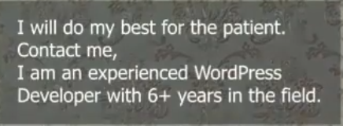
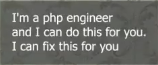
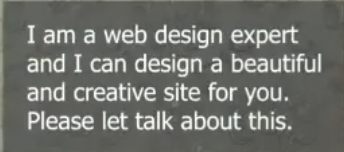
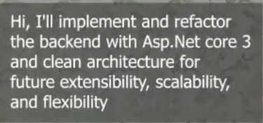
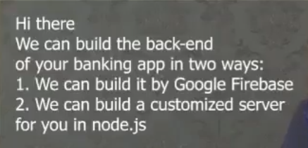
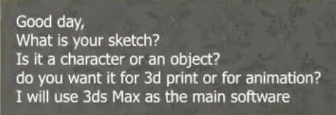
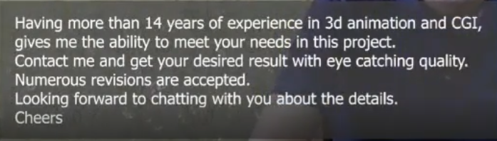

# نحوه بیدگذاری روی سایت

### یک بید خوب از این جهت مهمه که اولین تاچ‌پوینت ما با کارفرماست. یعنی اگر بتونیم از کلمات درستی استفاده کنیم و قیمت و زمان مناسبی به کارفرما پیشنهاد بدیم، شانس گرفتن پروژه خیلی بالا میره.

### چهار نکته اصلی در بید وجود داره

1. متن بید
2. قیمت پیشنهادی
3. زمان پیشنهادی
4. سرعت عمل در بیدگذاری از زمان ثبت پروژه

   * زمان استاندارد: پنج دقیقه

### قیمت و زمانی که توی یک بید ارسال می‌کنیم، نهایی نیست. شما می‌تونید در مذاکره اون قیمت و زمان رو تغییر بدید.

### هر پروژه‌ای که برای اون بید ارسال می‌کنیم، به این معنی نیست که حتماً باید به شما داده بشه. ما باید برای پروژه‌های زیادی بید ارسال کنیم. پس وقتی قیمت و زمان رو به کارفرما پیشنهاد می‌دید، خیلی حساسیت روی اون نداشته باشید.

---

    
    
    

متنی شبیه این معمولاً زیاد استفاده میشه:

> من خیلی خیلی با تجربه هستم و چندین سال در این تخصص فعالیت دارم. این هم رزومه کارهایی که قبلاً انجام دادم. به شغل شما علاقه‌مندم و ازتون می‌خوام با من وارد مذاکره بشید تا با هم پروژه رو انجام بدیم.

شاید ۶۰–۷۰ درصد فریلنسرها دقیقاً همین‌طور پروپوزال می‌نویسن. این متن بد نیست، اما اگر همه پروپوزال‌ها شامل همین جملات باشه و بخواید همونو کپی‌پیست کنید، شانس گرفتن پروژه خیلی پایین میاد.

---

### توی بیدمون راجع به چه موضوعاتی صحبت کنیم؟

1. کارفرما خوشش میاد شما درباره پروژه‌اش صحبت کنید.
2. کارفرما خوشش نمیاد صرفاً یک رزومه شخصی براش بفرستید؛ هرچند ارائه رزومه در بید می‌تونه مفید باشه.
3. بهتره بیشتر درباره خود پروژه صحبت کنید؛ اینکه چطور می‌تونید انجامش بدید.

---

### متن بید باید شامل دو بخش باشه

#### بخش اول (۲ تا ۳ خط):

به جای اینکه فقط بگیم *«من پروژه شما رو می‌تونم انجام بدم»*، بهتره توضیح بدیم:

* با چه نرم‌افزاری انجامش می‌دیم
* از چه کتابخونه‌ای استفاده می‌کنیم
* مسیر انجام پروژه چطوریه (مثلاً فاز اول چی هست، فاز دوم چی هست)

    
    
    

اینجوری به کارفرما **فکت** می‌دیم که توانایی انجام کار رو داریم.

✅ مهم‌ترین کار در بید اینه که از کارفرما **سؤال بپرسیم**.

خیلی وقت‌ها کارفرما برای جواب دادن به اون سؤال، با ما شروع به چت می‌کنه.

---

#### بخش دوم: معرفی خودمون

* توضیح بدیم در چه زمینه‌هایی تخصص داریم
* چند سال تجربه داریم
* چه کارهایی قبلاً انجام دادیم

📌 نکته مهم:

* نباید لینک به خارج از سایت بدیم.
* در متن بید بگید نمونه‌کارها توی **پورتفولیو** قرار داده شده و کارفرما می‌تونه اونجا ببینه.
* اگر ممکن بود، یک آفر هم اضافه کنید؛ مثلاً:
  *«من سه ماه پشتیبانی رایگان برای پروژه شما انجام می‌دم. اگر مشکلی یا باگی پیش بیاد، براتون رفع می‌کنم.»*

این پیشنهادها تأثیر مثبتی دارن. در نهایت از کارفرما بخواید که با شما وارد مذاکره بشه تا درباره جزئیات صحبت کنید.